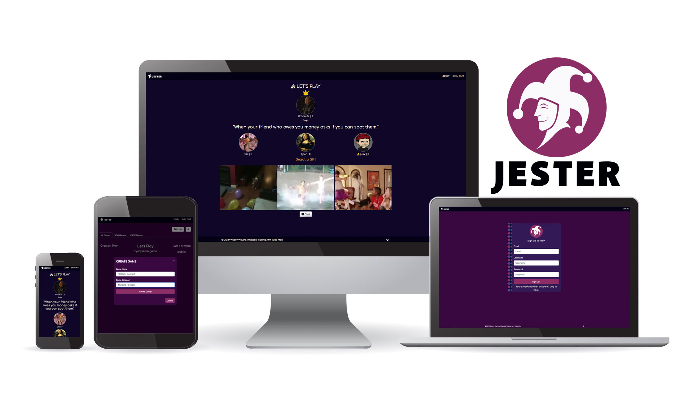

# JESTER

A turn based multiplayer web game.

**Link** [Jester](https://the-jester.herokuapp.com/)

## Built With:
* [NodeJS](https://nodejs.org/en/docs/)
* [Express](https://expressjs.com/)
* [Socket.io](https://socket.io/)
* [Passport](http://www.passportjs.org/)
* [MongoDB](https://www.mongodb.com/)
* [Mongoose](https://mongoosejs.com/)
* [React](https://reactjs.org/)
* [Redux](https://redux.js.org/)
* [Bootstrap](https://getbootstrap.com/)

## Description
A multiplayer web game designed with the concept of friends or strangers taking turns to amuse each other. Each turn a new king will be selected and jesters can submit a gif in an attempt to make the king laugh.

## Contributors
* [j-Riv](https://github.com/j-Riv)
* [Daffyd Zephyr](https://github.com/helloimdavidhaha)
* [Miguel Landin](https://github.com/MigPerLan)
* [Tyler Maples](https://github.com/tylerkmaples)
* [Yusuf Serunjogi](https://github.com/come2america)
